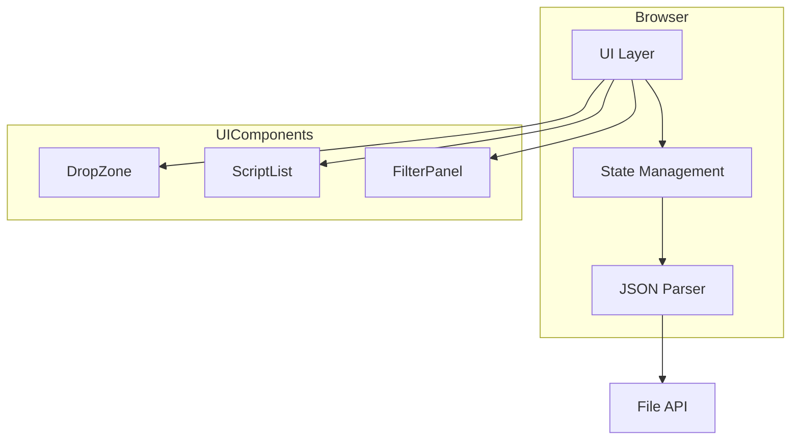
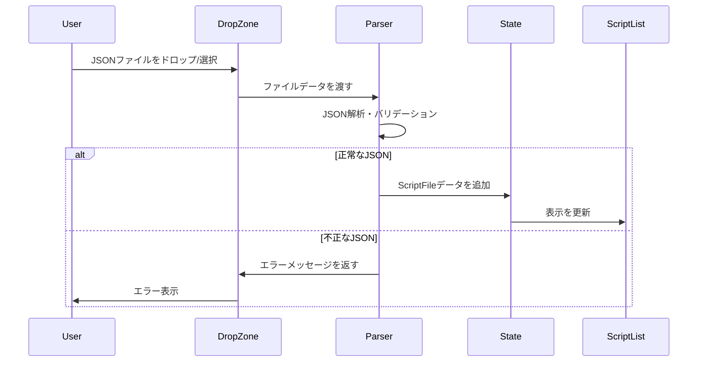
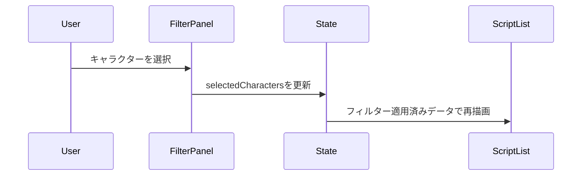
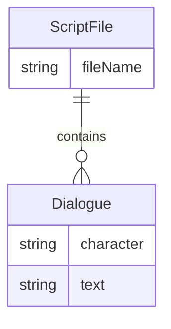

# Design Document

## Overview

**Purpose**: Script Viewerは、ゲームのキャラクターセリフデータを視覚的に閲覧するためのWebアプリケーションを提供する。

**Users**: ゲーム開発者、シナリオライター、翻訳者がセリフデータの確認・レビューに利用する。

**Impact**: 複数JSONファイルのセリフデータを統合し、ファイル別セクション表示とキャラクターフィルター機能により効率的な閲覧体験を実現する。

### Goals
- 複数JSONファイルの読み込みと統合表示
- ファイル別セクション分割による構造化された表示
- キャラクター単位のフィルタリング機能
- シンプルで直感的なUI

### Non-Goals
- サーバーサイド処理（純粋なクライアントサイドアプリ）
- JSONファイルの編集・保存機能
- 複雑な検索・ソート機能
- ユーザー認証・データ永続化

## Architecture

### Architecture Pattern & Boundary Map



**Architecture Integration**:
- **Selected pattern**: コンポーネントベースアーキテクチャ（React）- UIの再利用性と状態管理の明確化
- **Domain boundaries**: UI層・状態管理層・データ処理層の3層構造
- **New components rationale**: 各コンポーネントは単一責任を持ち、独立してテスト可能

### Technology Stack

| Layer | Choice / Version | Role in Feature | Notes |
|-------|------------------|-----------------|-------|
| Frontend | React 18 + TypeScript 5 | UIコンポーネント構築 | 型安全性とコンポーネント再利用 |
| Build Tool | Vite 5 | 開発サーバー・ビルド | 高速なHMRと最適化ビルド |
| State | React useState/useReducer | ローカル状態管理 | 外部ライブラリ不要の軽量構成 |
| Styling | CSS Modules | スコープ付きスタイル | シンプルな構成 |

## System Flows

### ファイル読み込みフロー



### フィルターフロー



## Requirements Traceability

| Requirement | Summary | Components | Interfaces | Flows |
|-------------|---------|------------|------------|-------|
| 1.1, 1.2, 1.3 | ファイル選択・D&D入力 | DropZone | FileInputHandler | ファイル読み込み |
| 1.4, 1.5 | エラーハンドリング | DropZone, JsonParser | ParseResult | ファイル読み込み |
| 2.1, 2.2, 2.3, 2.4 | セリフ表示・スクロール | ScriptList, ScriptItem | ScriptFile, Dialogue | - |
| 2.5, 2.6 | ファイル別セクション | FileSection | ScriptFile | - |
| 3.1, 3.2, 3.3, 3.4 | データ形式解析 | JsonParser | Dialogue, ParseResult | - |
| 4.1, 4.2, 4.3, 4.4 | UI/UX | App, DropZone, ScriptList | - | - |
| 5.1, 5.2, 5.3, 5.4, 5.5 | キャラクターフィルター | FilterPanel | FilterState | フィルター |

## Components and Interfaces

| Component | Domain/Layer | Intent | Req Coverage | Key Dependencies | Contracts |
|-----------|--------------|--------|--------------|------------------|-----------|
| App | UI | アプリケーションルート | 4.1-4.4 | DropZone, ScriptList, FilterPanel (P0) | State |
| DropZone | UI/Input | ファイル入力受付 | 1.1-1.5 | JsonParser (P0) | Service |
| JsonParser | Data | JSON解析・バリデーション | 3.1-3.4 | - | Service |
| ScriptList | UI/Display | セリフ一覧表示 | 2.1-2.6 | FileSection, ScriptItem (P0) | State |
| FileSection | UI/Display | ファイル別セクション | 2.5, 2.6 | ScriptItem (P1) | - |
| ScriptItem | UI/Display | 個別セリフ表示 | 2.2 | - | - |
| FilterPanel | UI/Filter | キャラクターフィルター | 5.1-5.5 | - | State |

### Data Layer

#### JsonParser

| Field | Detail |
|-------|--------|
| Intent | JSONファイルを解析しDialogue配列に変換する |
| Requirements | 3.1, 3.2, 3.3, 3.4 |

**Responsibilities & Constraints**
- JSONテキストをパースしDialogue配列を生成
- 不正なJSONに対してエラーを返す
- characterフィールド欠落時は「不明」を設定
- textフィールド欠落時は該当オブジェクトをスキップ

**Dependencies**
- External: Browser JSON API (P0)

**Contracts**: Service [x]

##### Service Interface

```typescript
interface Dialogue {
  character: string;
  text: string;
}

interface ParseSuccess {
  success: true;
  dialogues: Dialogue[];
}

interface ParseError {
  success: false;
  error: string;
}

type ParseResult = ParseSuccess | ParseError;

interface JsonParserService {
  parse(jsonText: string): ParseResult;
}
```

- Preconditions: jsonTextはstring型
- Postconditions: ParseSuccess時はDialogue配列を含む、ParseError時はエラーメッセージを含む
- Invariants: textフィールドが存在するオブジェクトのみDialogueに変換

### UI Layer

#### DropZone

| Field | Detail |
|-------|--------|
| Intent | ファイル選択・ドラッグ&ドロップによるファイル入力を受け付ける |
| Requirements | 1.1, 1.2, 1.3, 1.4, 1.5, 4.1 |

**Responsibilities & Constraints**
- ファイル選択ダイアログの表示
- ドラッグ&ドロップイベントの処理
- 複数ファイルの順次処理
- エラーメッセージの表示

**Dependencies**
- Inbound: App — レンダリング (P0)
- Outbound: JsonParser — ファイル解析 (P0)
- External: File API — ファイル読み込み (P0)

**Contracts**: Service [x] / State [x]

##### Service Interface

```typescript
interface ScriptFile {
  fileName: string;
  dialogues: Dialogue[];
}

interface FileLoadSuccess {
  success: true;
  file: ScriptFile;
}

interface FileLoadError {
  success: false;
  fileName: string;
  error: string;
}

type FileLoadResult = FileLoadSuccess | FileLoadError;

interface FileInputHandler {
  handleFiles(files: FileList): Promise<FileLoadResult[]>;
}
```

##### State Management

```typescript
interface DropZoneProps {
  onFilesLoaded: (files: ScriptFile[]) => void;
  onError: (errors: FileLoadError[]) => void;
}
```

**Implementation Notes**
- Integration: HTML5 File APIとFileReaderを使用
- Validation: .json拡張子チェック、JSON.parseによる構文検証
- Risks: 大容量ファイルでのメモリ使用量

#### ScriptList

| Field | Detail |
|-------|--------|
| Intent | 読み込んだセリフをファイル別セクションで一覧表示する |
| Requirements | 2.1, 2.2, 2.3, 2.4, 2.5, 2.6 |

**Responsibilities & Constraints**
- ファイル単位でセクション分割して表示
- 各セクションにファイル名見出しを表示
- フィルター適用後のセリフのみ表示
- スクロール可能なリスト表示

**Dependencies**
- Inbound: App — レンダリング (P0)
- Outbound: FileSection, ScriptItem — 子コンポーネント (P0)

**Contracts**: State [x]

##### State Management

```typescript
interface ScriptListProps {
  files: ScriptFile[];
  selectedCharacters: Set<string>;
}
```

#### FilterPanel

| Field | Detail |
|-------|--------|
| Intent | キャラクター一覧を表示しフィルター選択を受け付ける |
| Requirements | 5.1, 5.2, 5.3, 5.4, 5.5 |

**Responsibilities & Constraints**
- 読み込んだファイルからキャラクター一覧を抽出・表示
- 複数キャラクターの選択を許可
- フィルター状態の視覚的表示
- 全選択解除（クリア）機能

**Dependencies**
- Inbound: App — レンダリング (P0)

**Contracts**: State [x]

##### State Management

```typescript
interface FilterPanelProps {
  characters: string[];
  selectedCharacters: Set<string>;
  onSelectionChange: (selected: Set<string>) => void;
}
```

**Implementation Notes**
- Integration: チェックボックスまたはトグルボタンでキャラクター選択
- Validation: 空選択時は全キャラクター表示として扱う

#### FileSection

| Field | Detail |
|-------|--------|
| Intent | 単一ファイルのセリフをセクションとして表示する |
| Requirements | 2.5, 2.6 |

**Responsibilities & Constraints**
- ファイル名を見出しとして表示
- フィルター適用後のセリフのみ表示

**Contracts**: State [x]

##### State Management

```typescript
interface FileSectionProps {
  file: ScriptFile;
  selectedCharacters: Set<string>;
}
```

#### ScriptItem

| Field | Detail |
|-------|--------|
| Intent | 個別のセリフとキャラクター名を表示する |
| Requirements | 2.2, 4.2, 4.3 |

**Responsibilities & Constraints**
- キャラクター名とセリフを視覚的に区別して表示

**Contracts**: State [x]

##### State Management

```typescript
interface ScriptItemProps {
  dialogue: Dialogue;
}
```

## Data Models

### Domain Model



**Entities**:
- **ScriptFile**: JSONファイル単位のセリフデータ集合
- **Dialogue**: 個別のセリフデータ（キャラクター名とテキスト）

**Business Rules**:
- Dialogueはtextフィールドが必須
- characterフィールド欠落時は「不明」を設定

### Application State Model

```typescript
interface AppState {
  files: ScriptFile[];
  selectedCharacters: Set<string>;
  errors: FileLoadError[];
}
```

## Error Handling

### Error Strategy
クライアントサイドで完結するため、ユーザーに即座にフィードバックを提供する。

### Error Categories and Responses

**User Errors (入力エラー)**:
- 非JSONファイル選択 → 「JSONファイルを選択してください」
- 不正なJSON構文 → 「ファイル名: JSONの解析に失敗しました」
- 空の配列 → 「セリフがありません」

**Validation Errors (データ検証)**:
- textフィールド欠落 → 該当オブジェクトをスキップ（警告なし）
- characterフィールド欠落 → 「不明」として表示

### Monitoring
- コンソールログによるデバッグ情報出力
- エラー発生時のUI表示

## Testing Strategy

### Unit Tests
- JsonParser: 正常JSON解析、不正JSON検出、フィールド欠落処理
- FilterPanel: キャラクター抽出、選択状態管理
- ScriptList: フィルター適用ロジック

### Integration Tests
- ファイル読み込みからリスト表示までの一連フロー
- 複数ファイル読み込み時の統合表示
- フィルター適用時の表示更新

### E2E/UI Tests
- ファイルドラッグ&ドロップ操作
- ファイル選択ダイアログ操作
- キャラクターフィルター操作
- スクロール動作

## Performance & Scalability

**Target Metrics**:
- 初回読み込み: 1秒以内
- ファイル解析: 1MBあたり100ms以内
- フィルター適用: 100ms以内

**Optimization**:
- React.memoによる不要な再レンダリング防止
- 大量セリフ時の仮想スクロール検討（将来拡張）
